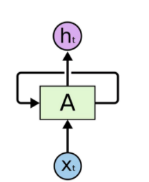
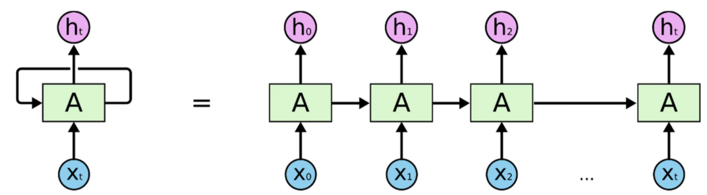
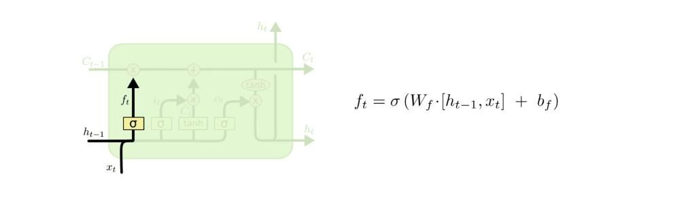
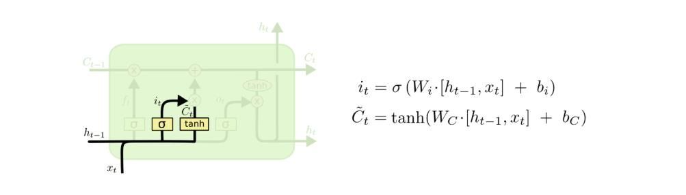
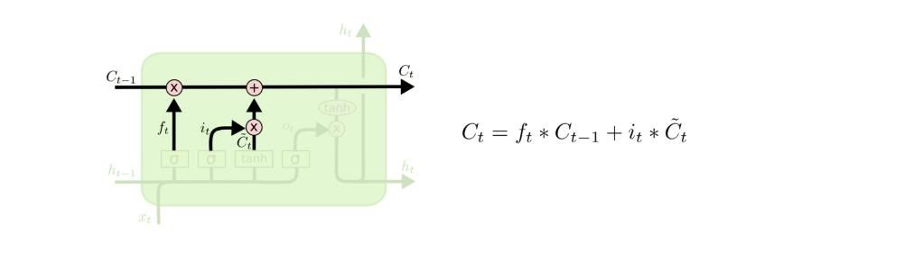
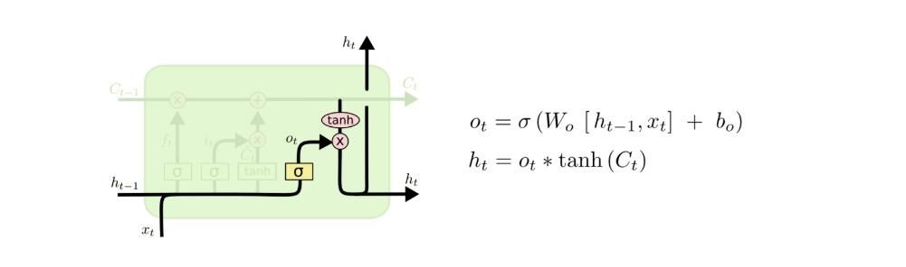

# LSTM

### 什么是LSTM？

RNN 会受到短时记忆的影响。如果一条序列足够长，那它们将很难将信息从较早的时间步传送到后面的时间步。




$$H^{(t)}=\sigma(W^{ht}\cdot X{(t)}+W^{hh}\cdot H^{(t-1)}+b_n) $$




LSTM 是**解决短时记忆**问题的解决方案，它们具有称为**“门”**的内部机制，可以调节信息流。

这些“**门**”可以知道序列中哪些重要的数据是需要**保留**，而哪些是要**删除**的。 随后，它可以沿着长链序列传递相关信息以进行预测，几乎所有基于循环神经网络的技术成果都是通过这两个网络实现的。 


### LSTM体系结构

LSTM被称为门结构：一些数学运算的组合，这些运算使信息流动或从计算图的那里保留下来。因此，它能够“决定”其长期和短期记忆，并输出对序列数据的可靠预测：


LSTM单元中的预测序列。注意，它不仅会传递预测值，而且还会传递一个c，c是长期记忆的代表

#### 遗忘门

遗忘门（forget gate）是输入信息与候选者一起操作的门，作为长期记忆。在输入、隐藏状态和偏差的第一个线性组合上，应用一个sigmoid函数：




sigmoid将遗忘门的输出“缩放”到0-1之间，然后，通过将其与候选者相乘，我们可以将其设置为0，表示长期记忆中的“遗忘”，或者将其设置为更大的数字，表示我们从长期记忆中记住的“多少”。

#### 输入门

输入门是将包含在输入和隐藏状态中的信息组合起来，然后与候选和部分候选c''u t一起操作的地方：






在这些操作中，决定了多少新信息将被引入到内存中，如何改变——这就是为什么我们使用tanh函数

（从-1到1）。我们将短期记忆和长期记忆中的部分候选组合起来，并将其设置为候选。


#### 输出门和隐藏状态（输出）

之后，我们可以收集o_t作为LSTM单元的输出门，然后将其乘以候选单元（长期存储器）的tanh，后者已经用正确的操作进行了更新。网络输出为h_t。


LSTM单元方程


​									$${f_t} = \sigma(U_fx_t+V_fh_{t-1}+b_f)$$

​									$$i_t = \sigma(U_ix_i+V_ih_{t-1}+b_i)$$

​									$$o_t = \sigma(U_ox_i+V_oh_{t-1}+b_0)$$

​									$$g_t = tanh(U_gx_t+V_gh_{t-1}+b_g)  等价于 \tilde{c_t}$$

​									$$c_t = f_t  \cdot c_{t-1} + i_t \cdot g_t $$

​									$$h_t = o_t \cdot tanh(c_t)$$


#### 代码实现部分：

```python
nn.Parameter()  
```

可以使用nn.Parameter()来转换一个固定的权重数值，使的其可以跟着网络训练一直调优下去，学习到一个最适合的权重值。

也就是说其作用是使得当前的参数可以被保存梯度

```python
torch.Tensor(2,1)

# 输出结果
tensor([[0.],
        [0.]])
```

生成一个 size 为(a,b) 的全0张量

当使用nn.Parameter()后，这个全0张量会被赋予一个随机值

```python
nn.Parameter(torch.Tensor(2，1))  

# 输出结果
Parameter containing:
tensor([[9.1477e-41],
        [1.0739e-05]], requires_grad=True)

# requires_grad=True 保留梯度信息
```

```markdown
stdv = 1.0 / math.sqrt(128)
```

$$
stdv =  {1\over\sqrt{128}}
$$

